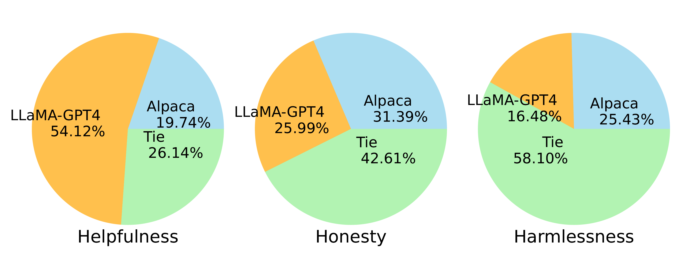
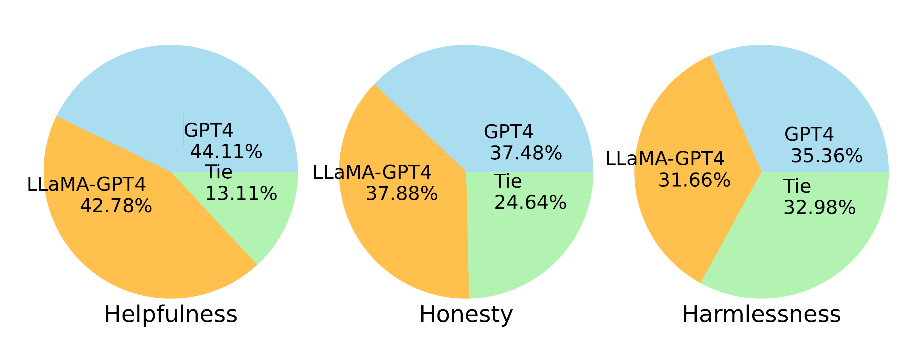

# Instruction Tuning with GPT-4

Baolin Peng*, Chunyuan Li*, Pengcheng He*, Michel Galley, Jianfeng Gao (*Equal Contribution)

[[Project Page](https://instruction-tuning-with-gpt-4.github.io/)] [[Paper](https://arxiv.org/abs/2304.03277)] 
<p align="center">
     <br>
    Pronounced as "GPT-4-LLM" or "GPT-for-LLM", image is generated by <a href="https://gligen.github.io/">GLIGEN</a>
</p>


[](https://github.com/tatsu-lab/stanford_alpaca/blob/main/LICENSE)
[](https://github.com/tatsu-lab/stanford_alpaca/blob/main/DATA_LICENSE)


This is the repo for the GPT-4-LLM, which aims to share data generated by GPT-4 for building an instruction-following LLMs with supervised learning and reinforcement learning. The repo contains:
- English Instruction-Following [Data](#data-release) generated by GPT-4 using Alpaca prompts for fine-tuning LLMs.
- Chinese Instruction-Following [Data](#data-release) generated by GPT-4 using Chinese prompts translated from Alpaca by ChatGPT.
- Comparison [Data](#data-release) ranked by GPT-4 to train reward models.
- Answers on Unnatural Instructions [Data](#data-release) from GPT-4 to quantify the gap between GPT-4 and instruction-tuned models at scale.


**Usage and License Notices**: The data is intended and licensed for research use only. The dataset is CC BY NC 4.0 (allowing only non-commercial use) and models trained using the dataset should not be used outside of research purposes.


- [Overview](#overview)
- [GPT-4 Data Release](#data-release)
- [How Good is the Data?](#how-good-is-the-data)
- [Fine-tuning with the Data](#fine-tuning-with-the-data)
- [Reproduce Figure Plots](#collect-results-and-reproduce-figure-plots)

## :fire: News
<!---
* **[2023.04.07]** Data restored.
* **[2023.04.07]** :warning: We turn off the data downloading temporarily.
-->
* **[2023.04.17]** Visual instruction tuning with GPT-4 is released! Please check out the multimodal model LLaVA: [[Project Page](https://llava-vl.github.io/)] [[Paper](https://arxiv.org/abs/2304.08485)] [[Demo](https://llava.hliu.cc/)]  [[Data](https://huggingface.co/datasets/liuhaotian/LLaVA-Instruct-150K)] [[Model](https://huggingface.co/liuhaotian/LLaVA-13b-delta-v0)]
* **[2023.04.15]** Updated comparision data, including three model responses and GPT-4 evaluation scores.
* **[2023.04.06]** Paper and data are released.


## Overview
Large Language Models (LLMs) have shown impressive generalization capabilities such as in-context-learning and chain-of-thoughts reasoning. To enable LLMs to follow natural language instructions and complete real-world tasks, researchers have been exploring methods of instruction-tuning of LLMs. To advance the state of the art of instruction-tuning for LLMs, we present the first attempt to use GPT-4 to generate instruction-following data for LLM finetuning. 

## Data Release

* [`alpaca_gpt4_data.json`](./data/alpaca_gpt4_data.json) contains 52K instruction-following data generated by GPT-4 with prompts in Alpaca.
This JSON file has the same format as Alpaca data, except the output is generated by GPT-4:

    - `instruction`: `str`, describes the task the model should perform. Each of the 52K instructions is unique.
    - `input`: `str`, optional context or input for the task. 
    - `output`: `str`, the answer to the instruction as generated by `GPT-4`.


* [`alpaca_gpt4_data_zh.json`](./data/alpaca_gpt4_data_zh.json) contains 52K instruction-following data generated by GPT-4 with Alpaca prompts translated into Chinese by ChatGPT. This JSON file has the same format.

* [`comparison_data.json`](./data/comparison_data_v2.json) ranked responses from three models, including GPT-4, GPT-3.5 and OPT-IML by asking GPT-4 to rate the quality.

    - `user_input`: `str`, prompts used for quering LLMs.
    - `completion_a`: `str`, a model completion which is ranked higher than completion_b.
    - `completion_b`: `str`, a different model completion which has a lower quality score. 

* [`unnatural_instruction_gpt4_data.json`](./data/unnatural_instruction_gpt4_data.json) contains 9K instruction-following data generated by GPT-4 with prompts in Unnatural Instruction. This JSON file has the same format as Alpaca data.

## How Good is the Data

Human evaluation was performed on model generation results using Amazon Mechanical Turk following Helpfulness, Honestness and Harmlessness criteria by [Anthropic AI](https://arxiv.org/abs/2112.00861). The results are summarized as follows:
- Two instruction-tuned LLaMA models were compared, fine-tuned on data generated by GPT-4 and GPT-3 respectively.
- LLaMA-GPT-4 performs substantially better than LLaMA-GPT-3 in the "Helpfulness" criterion.
- LLaMA-GPT-4 performs similarly to the original GPT-4 in all three criteria, suggesting a promising direction for developing state-of-the-art instruction-following LLMs.




## Fine-tuning with the data
We follow the same reciple to fine-tune LLaMA as Alpaca using standard Hugging Face training code.

To reproduce our results with LLaMA 7B, first setup Alpaca repo and run the following CMDs:
```bash
## cmd we used to train LLaMA on 16*V100
torchrun --nproc_per_node=16 
--master_port=12345 train.py 
--model_name_or_path PATH/TO/LLaMA
--data_path ./data/alpaca_gpt4_data.json 
--output_dir PATH/TO/SAVE
--num_train_epochs 3 
--per_device_train_batch_size 1 
--per_device_eval_batch_size 1 
--gradient_accumulation_steps 4 
--evaluation_strategy "no" 
--save_strategy "steps" 
--save_steps 200 
--save_total_limit 1 
--learning_rate 2e-5 
--weight_decay 0. 
--warmup_ratio 0.03 
--lr_scheduler_type "cosine" 
--logging_steps 1 
--deepspeed configs/ds_config.json
```
To evaluate the results, we highly recommend users refer to [Vicuna](https://vicuna.lmsys.org/) as they have provided awesome serving scripts and evaluation piplelines.


## Collect results and reproduce figure plots

The results can be plotted using the included IPython notebook plots/main_plots.ipynb. Start the IPython Notebook server:

```
$ cd plots
$ ipython notebook
```

Select the [`main_plots.ipynb`](./plots/main_plots.ipynb) notebook and execute the included code. Note that without modification, we have copyed our extracted results into the notebook, and script will output figures in the paper. Some related data for plots have been provided in [data](./plots/data), the generated plots are saved in [plots/output](./plots/output) If you've run your own training and wish to plot results, you'll have to organize your results in the same format instead. 

*Shortcut: to skip all the work and just see the results, take a look at this notebook with [cached plots](./plots/main_plots.ipynb).*

## Citation
```
@article{peng2023instruction,
  title={Instruction Tuning with GPT-4},
  author={Peng, Baolin and Li, Chunyuan and He, Pengcheng and Galley, Michel and Gao, Jianfeng},
  journal={arXiv preprint arXiv:2304.03277},
  year={2023}
}
```

## Acknowledgement
This repo benefits from [LLaMA](https://github.com/facebookresearch/llama), [Alpaca](https://github.com/tatsu-lab/stanford_alpaca), and [Vicuna](https://github.com/lm-sys/FastChat). Thanks for their wonderful works.


